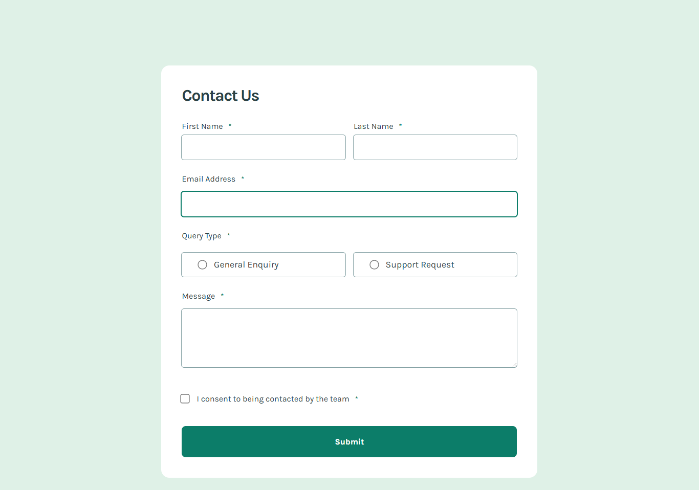

# 💬 Contact Form – Frontend Mentor Challenge

This is a responsive, accessible, and visually clean **Contact Form** built as part of a Frontend Mentor challenge. The form includes real-time validation, interactive UI feedback, and a custom success message—all styled with custom CSS.




---

## 🚀 Live Demo

👉 [View Live Site](https://bhavikthakur.github.io/contact-form-card/)

---

## 📌 Features

- ✅ Responsive layout using Flexbox and media queries
- ✅ Custom form validation with JavaScript
- ✅ Interactive query selection (radio inputs)
- ✅ Success message with animated state
- ✅ Styled checkboxes and radio buttons using icons
- ✅ Mobile-friendly design with smooth UX
- ✅ Form state handling using vanilla JS (no libraries)

---

## 🛠️ Tech Stack

- **HTML5** – semantic structure  
- **CSS3** – custom properties, responsive design  
- **JavaScript** – DOM manipulation, form validation  
- **Google Fonts** – 'Karla' for modern typography  

---

## 📂 Folder Structure

```bash
├── assets/
│   └── images/                # Icons & favicon
├── css/
│   ├── reset.css              # CSS reset for consistency
│   ├── style.css              # Core styles
│   └── media.css              # Media queries
├── app.js                     # JavaScript for interactivity & validation
├── index.html                 # Markup
└── README.md                  # This file

```
## 🧠 What I Learned
Writing clean, semantic HTML with accessibility in mind <br>

Implementing custom validation logic using JavaScript <br>

Creating a toggleable success message and conditional UI states <br>

Managing interactive form inputs without any frameworks  <br>

Designing and testing mobile-first layouts <br>


## 🤝 Acknowledgements
Frontend Mentor – for the design challenge <br>

Karla Font – used for elegant, readable typography

## 🤝 Connect With Me  
👨‍💻 GitHub: [bhavikthakur](https://github.com/bhavikthakur)  <br>
💼 LinkedIn: [Bhavik Thakur](https://www.linkedin.com/in/bhavik-thakur/)  <br>
🐦 Twitter: [Bhavik Thakur](https://x.com/BhavikkThakur)  <br>
